# Dastavez — Screenshots

Visual walkthrough of the officer console, the test inputs, and the three
verification outcomes the system distinguishes.

Smart India Hackathon 2026 · Problem Statement **26188** · Team **BYTESENTINEL**

Back to the [main README](../README.md).

---

## Contents

- [The application](#the-application)
- [Inputs](#inputs)
- [Outputs — the three outcomes](#outputs--the-three-outcomes)
- [Other screens](#other-screens)

---

## The application

### Landing page

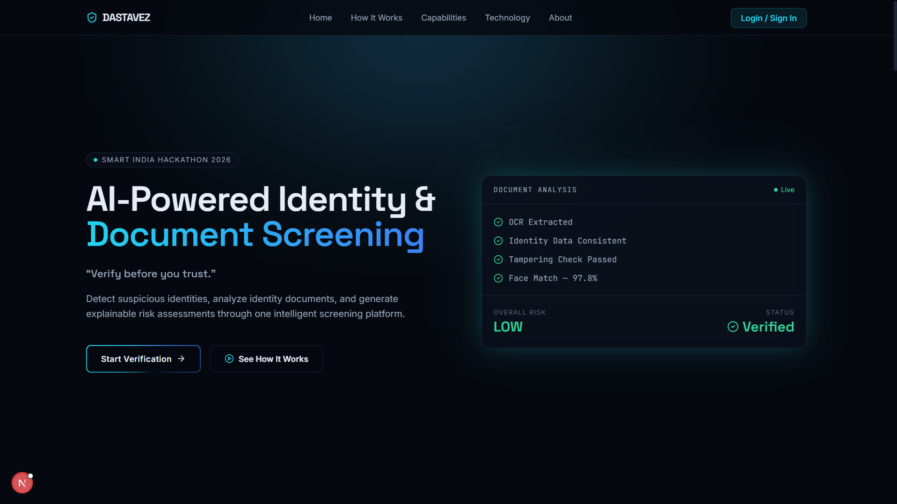

### Officer sign-in

Badge number or email, authenticated against the `officers` table with bcrypt.
On success Flask sets a signed, `HttpOnly` session cookie and redirects to the
console.

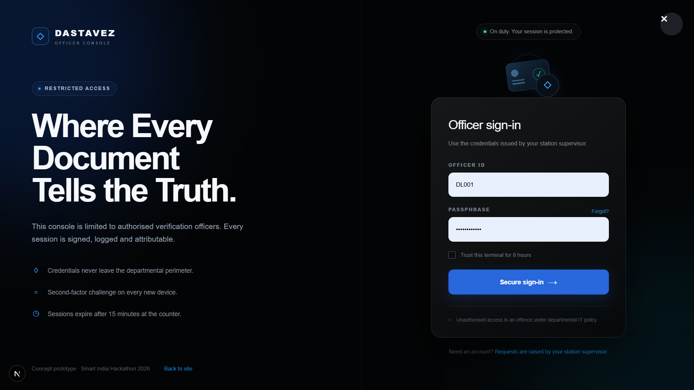

### Officer dashboard

Screening counts, weekly activity, risk distribution, recent cases, and live
system status.

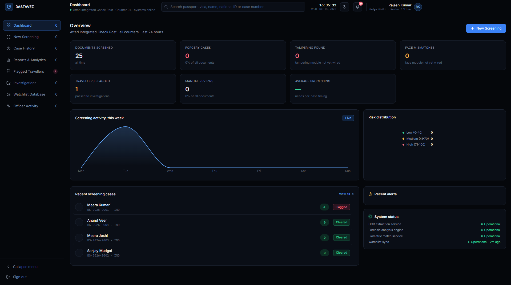

Worth noting what the empty tiles say. "Tampering found" reads *"tampering
module not yet wired"* and "Average processing" reads *"needs per-case
timing"* — placeholders rather than invented numbers, because the forensics
producer is not written yet and processing time needs timing columns that do
not exist. Fake metrics are the fastest way to lose a reviewer's trust.

### Feature overview

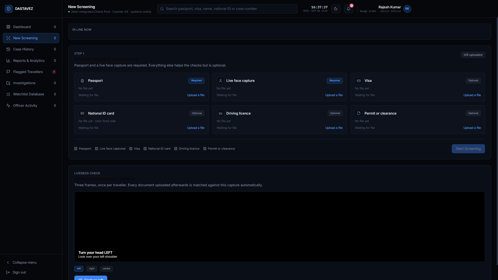

---

## Inputs

The documents and live capture fed into the pipeline for the runs shown below.

### A passport with one altered field

Surname changed. Everything else left intact — this tests whether a single
field discrepancy is caught rather than washed out by the fields that still
agree.

### A passport whose photo is not the traveller

Valid document data, wrong person. This is the failure mode a document-only
check cannot detect.

### A clean passport matching a seeded reference record

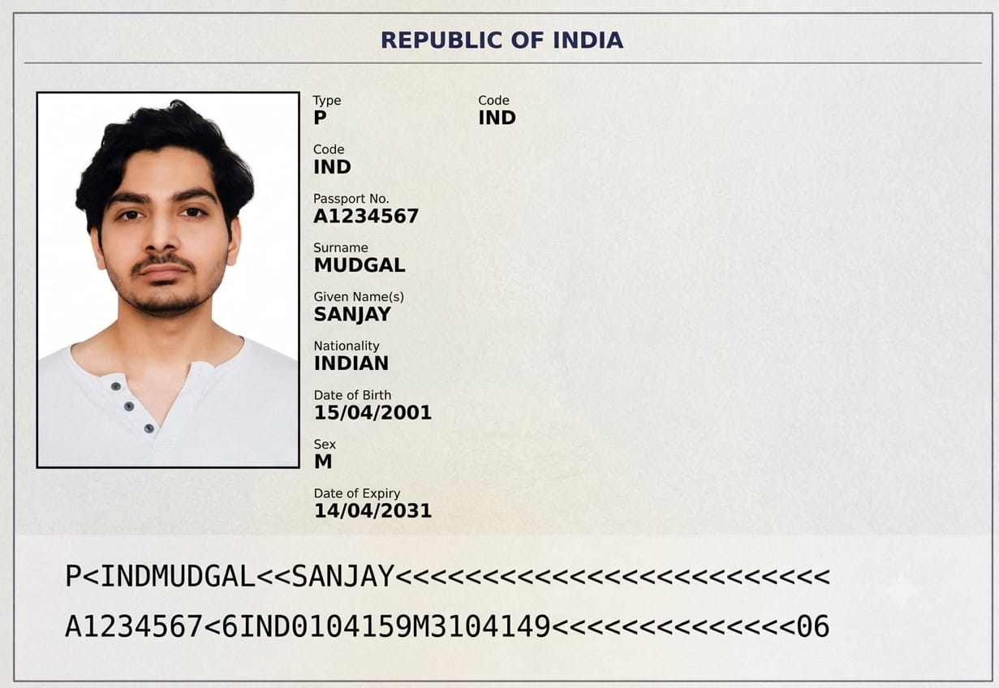

### The live capture used as the face reference

Captured through the liveness check — head left, head right, centre. The
verified centre frame becomes the case's reference for every subsequent
document comparison.

---

## Outputs — the three outcomes

### 1. Verified against record

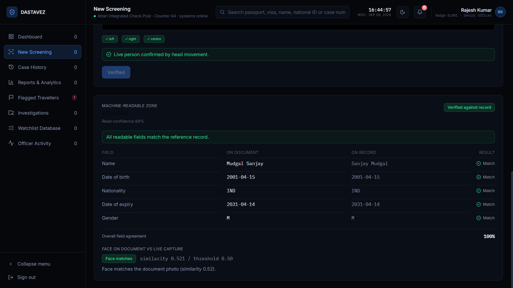

All five MRZ fields agree with the reference row, and liveness passed on all
three poses.

The interesting row is **Name**: the document reads `Mudgal Sanjay`, the record
reads `Sanjay Mudgal`, and the result is still **Match**. Names are compared by
**word-set overlap** rather than character distance, because the real-world
difference between an MRZ name and a database name is word order and truncation
— MRZ is surname-first by standard — not misspelling. A naive string comparison
would produce a false mismatch on essentially every document.

Overall field agreement 100%. Face similarity 0.521 against a 0.50 threshold.

### 2. Face does not match

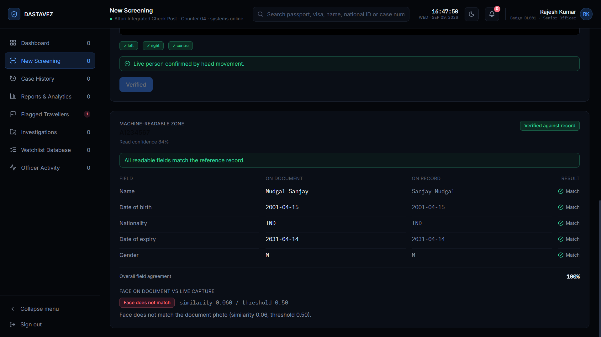

The document data is entirely valid — the same 100% field agreement as above,
same "verified against record" badge — but the live capture scores **0.060**
against the document photo.

This is the case that justifies the biometric layer. A genuine, unaltered
passport presented by the wrong person passes every data check there is. Only
comparing the face to a verified live capture catches it.

### 3. Needs manual review

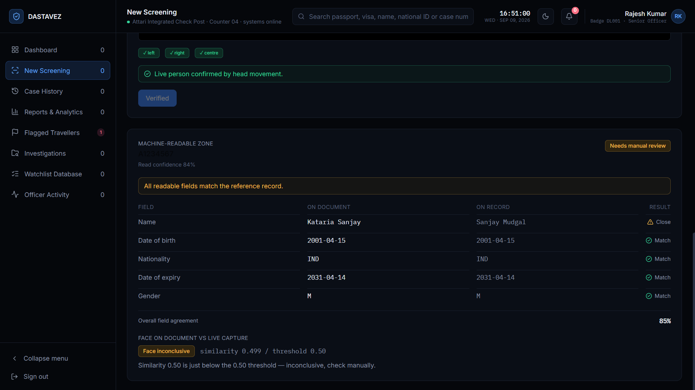

The surname was altered to `Kataria`. Field agreement drops to 85%, the name
row is flagged, and every other field still matches — the discrepancy is
localised and named rather than collapsing into a single red verdict.

Face similarity lands at **0.499**, just under the 0.50 threshold, and is
reported as **inconclusive rather than a rejection**, with an explicit
instruction to check manually. Treating 0.499 as equivalent to the 0.060 in the
previous case would misrepresent what the number means. A borderline score is
information, and hiding it inside a binary throws that information away.

---

## Other screens

### Case history

Every screening, filterable by date, nationality, risk, officer, decision and
document type. Each row links to the full case with its documents and per-stage
check results.

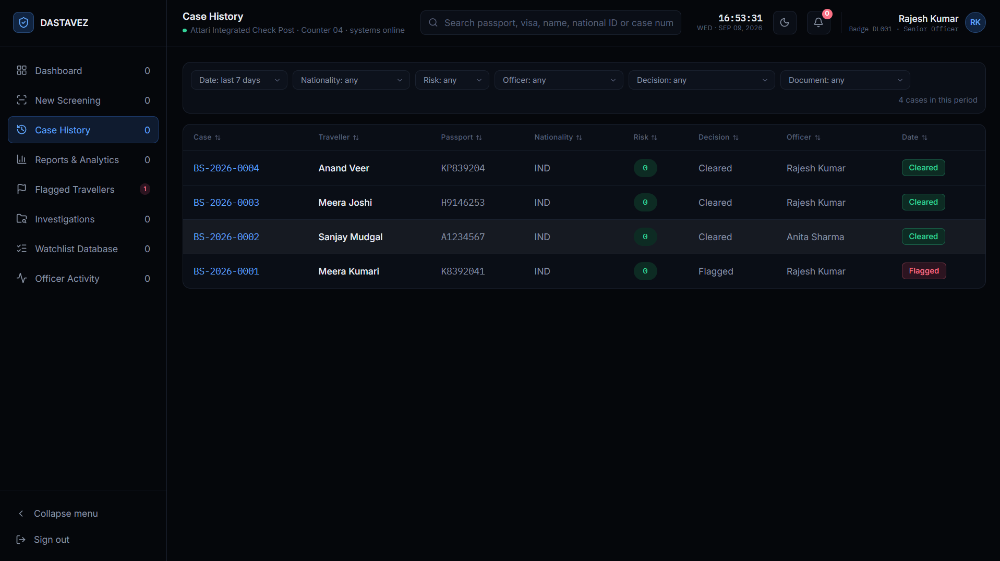

### Flagged travellers

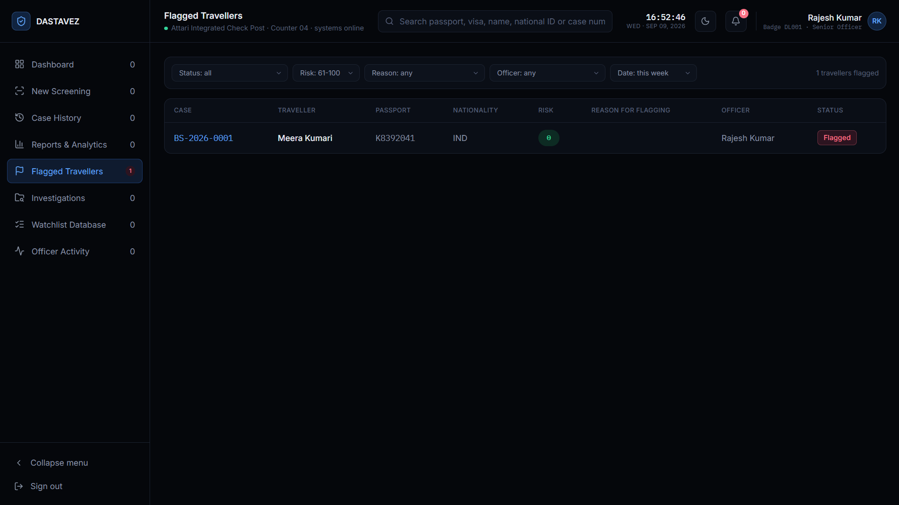

### Officer activity

The audit trail — every officer action with its timestamp, which is what makes
a decision reviewable after the fact.

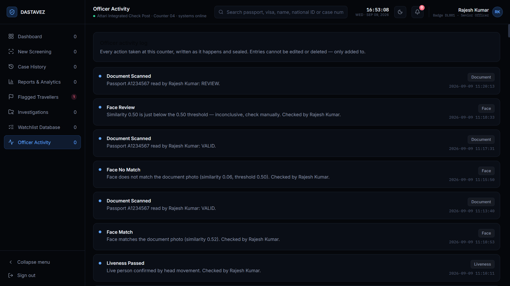

### Reference database

The issuing records that scanned documents are checked against. A screening
only returns VALID when the extracted passport number matches a row here and
that row's status is ACTIVE.

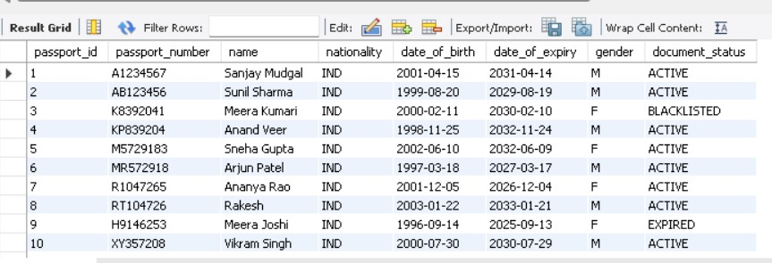